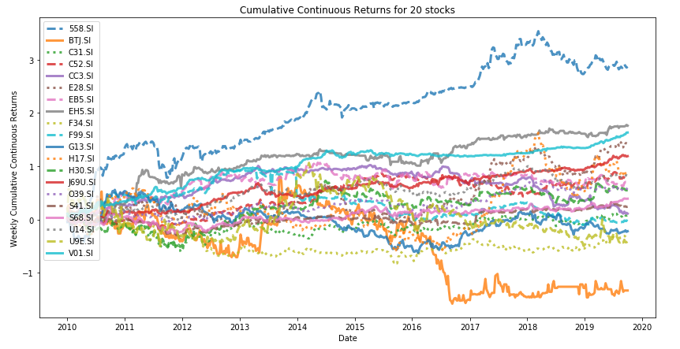
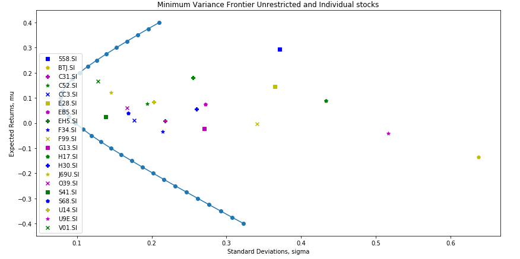
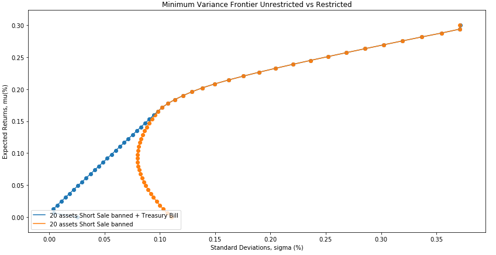

## Finance Minimum Variance Frontier using Python (Numpy and Pandas)
Minimum Variance Frontier is XXX. Further reference can be found in YYY.

## Python Version
This notebook is done on Google Colaboratory, which is under Python 3.6

## Data
* Most of the data is accessed through a yahoo finance API, using the library "pandas_datareader".
* Allstocks.csv is a file that is accessed through this library.
* However, nonstockRates.csv is retrieved through provided source from university, i.e. the bloomberg terminal.

## Setup and Launch
To run this program:
* Simply fork and download the entire repository
* Run the jupyter notebook

# Example illustration
Simple Illustrations of stock prices\
```
from pandas.plotting import register_matplotlib_converters
register_matplotlib_converters()

plt.figure(figsize = (14,7))
i = 0
style = ['--', '-', ":"]
for c in returns_weekly.columns.values:
    plt.plot(cum_returns_weekly.index,cum_returns_weekly[c], lw = 3,
             linestyle = style[i%3], alpha =0.8, label = c)
    i = i+1
plt.legend(loc = 'upper left', fontsize = 10)
plt.ylabel('Weekly Cumulative Continuous Returns')
plt.xlabel('Date')
plt.title('Cumulative Continuous Returns for 20 stocks')
plt.show()
plt.close()
```

```
# Plotting the graph and saved as Q4,5.png
y = annual_returns_df["Annual Returns"]
z = annual_std_df["Annual Standard deviation"]
n = annual_returns_df.index

plt.figure(figsize = (14,7))
plt.scatter(pt1ssAllowed["sigma"],pt1ssAllowed.index)
plt.plot(pt1ssAllowed["sigma"], pt1ssAllowed.index)

marker = ["s", "p", "P" , "*", "x"]
colours = ['b', 'y', 'm', 'g']

a = [(n[0])]
for i in range (1,len(n)):
    a.append((n[i]))
a = tuple(a)

b = [(plt.scatter(z[0],y[0], marker = marker[0], color = colours[0]))]
for i in range(1,len(n)):
    b.append((plt.scatter(z[i],y[i], marker = marker[i%5], color = colours[i%4])))
b = tuple(b)

plt.legend(b, a, loc = 'lower left')

plt.ylabel('Expected Returns, mu')
plt.xlabel('Standard Deviations, sigma')
plt.title('Minimum Variance Frontier Unrestricted and Individual stocks')
plt.show()
plt.close()
```


```
# short sale not allowed
bnds = ((0,None),)*21

trials = 50
mu_list = np.linspace(0.0,0.3,num = trials)

bnds2 = ((0,None),)*20
sigmaVector = [None]*trials
for i in range(trials):
    mu = mu_list[i]
    sol = solveWeights(bnds2,0,annual_returnsq16,annual_cov_matrixq16,mu_list[i],0)
    sigmaVector[i] = sol.fun
pt2ssNA = pd.DataFrame(np.sqrt(sigmaVector), index =  mu_list, columns = ["sigma"])

sigmaVector = [None]*trials
for i in range(trials):
    mu = mu_list[i]
    sol = solveWeights(bnds,0,annual_returns,annual_cov_matrix,mu_list[i],0)
    sigmaVector[i] = sol.fun
pt3ssNATB = pd.DataFrame(np.sqrt(sigmaVector), index =  mu_list, columns = ["sigma"])


plt.figure(figsize = (14,7))
plt.scatter(pt3ssNATB["sigma"],pt3ssNATB.index)
plt.plot(pt3ssNATB["sigma"], pt3ssNATB.index, label = "20 assets Short Sale banned + Treasury Bill")
plt.scatter(pt2ssNA["sigma"],pt2ssNA.index)
plt.plot(pt2ssNA["sigma"], pt2ssNA.index, label = "20 assets Short Sale banned")

plt.legend(loc = 'lower left')
plt.ylabel('Expected Returns, mu(%)')
plt.xlabel('Standard Deviations, sigma (%)')
plt.title('Minimum Variance Frontier Unrestricted vs Restricted')
plt.show()
plt.close()
```

